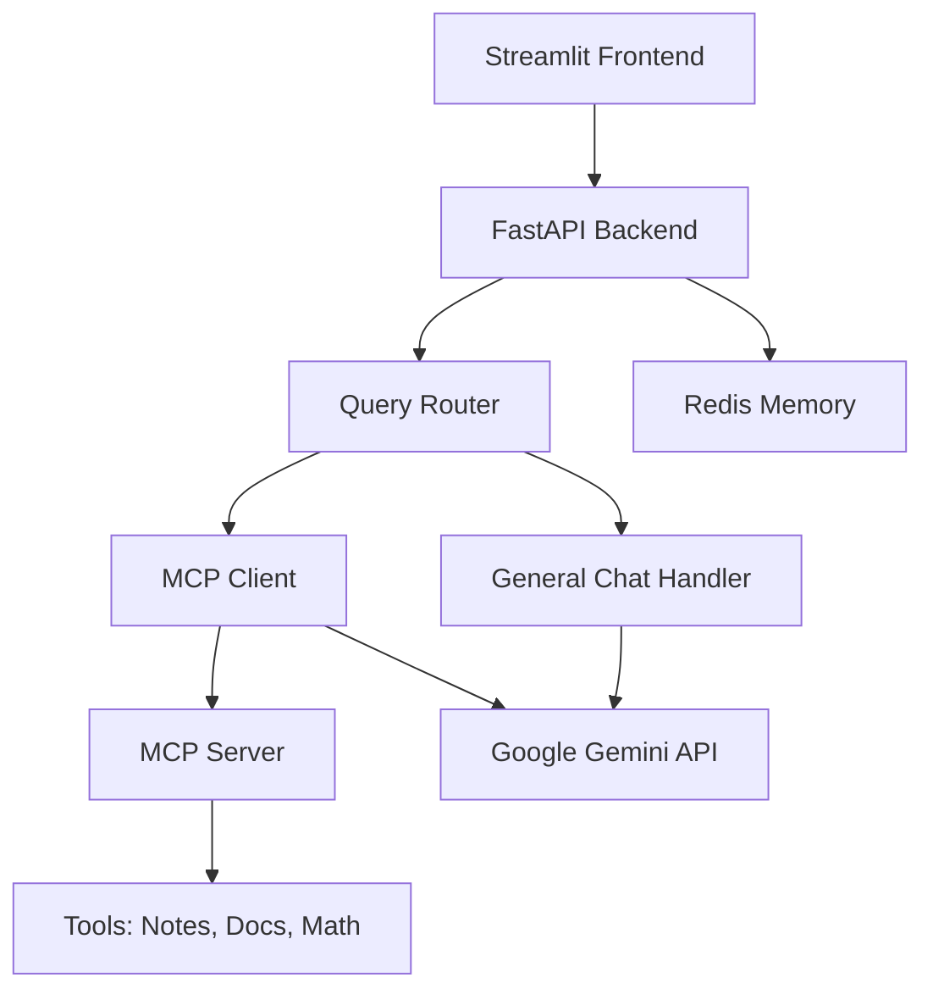

# 🤖 MCP Chatbot v1.0

An intelligent conversational AI system built with **FastAPI**, **Streamlit**, and **Google Gemini**, featuring Redis-based memory, smart routing, and extensible MCP (Model Context Protocol) tool integration.

## ✨ Features

- 🧠 **Redis Memory System** - Persistent conversation history across sessions
- 🔀 **Intelligent Query Routing** - Automatic tool selection based on user intent  
- 🛠️ **MCP Tool Integration** - Extensible protocol for adding custom tools
- 📝 **Note Management** - Add, search, and organize personal notes
- 📚 **Documentation Search** - Search official docs from multiple libraries
- 🧮 **Math Calculations** - Safe mathematical expression evaluation
- 💬 **Natural Conversations** - Direct Gemini integration for general chat
- 🌐 **Modern Web UI** - Clean Streamlit interface with real-time updates
- ⚡ **Production Ready** - Comprehensive error handling and monitoring

## 🏗️ Architecture



## 🚀 Quick Start

### Prerequisites

- Python 3.8+
- Redis server
- Google Gemini API key
- (Optional) Serper API key for documentation search

### 1. Installation

```bash
# Clone the repository
git clone https://github.com/ssilva9912/mcp-chatbot.git
cd mcp-chatbot

# Create virtual environment
python -m venv .venv
source .venv/bin/activate  # On Windows: .venv\Scripts\activate

# Install dependencies
pip install -r requirements.txt
```

### 2. Environment Configuration

Create a `.env` file in the root directory:

```bash
# ============================
# REQUIRED: Gemini AI API
# ============================
GEMINI_API_KEY=your_gemini_api_key_here
# Alternative name (either works):
# GOOGLE_API_KEY=your_gemini_api_key_here

# ============================
# REQUIRED: Redis Configuration  
# ============================
REDIS_HOST=localhost
REDIS_PORT=6379
REDIS_PASSWORD=
REDIS_DB=0
SESSION_EXPIRY_DAYS=30

# ============================
# OPTIONAL: Documentation Search
# ============================
SERPER_API_KEY=your_serper_api_key_here

# ============================
# OPTIONAL: Advanced Routing
# ============================
USE_SIMPLE_ROUTER=true
OLLAMA_BASE_URL=http://localhost:11434
OPENROUTER_API_KEY=your_openrouter_key_here

# ============================
# SERVER CONFIGURATION
# ============================
MCP_SERVER_PATH=server/server.py
```

### 3. Start Redis

```bash
# Using Docker (recommended)
docker run -d --name redis -p 6379:6379 redis:alpine

# Or install locally and start
redis-server
```

### 4. Launch the Application

**Terminal 1 - Start MCP Server:**
```bash
cd server
python server.py
```

**Terminal 2 - Start FastAPI Backend:**
```bash
cd api
python main.py
```

**Terminal 3 - Start Streamlit Frontend:**
```bash
streamlit run main.py
```

### 5. Access the Application

- **Frontend**: http://localhost:8501
- **API Documentation**: http://localhost:8000/docs
- **Health Check**: http://localhost:8000/health

## 📁 Project Structure

```
mcp-chatbot/
├── api/                          # FastAPI backend
│   ├── main.py                   # Main FastAPI application
│   ├── mcp_client.py             # MCP client for Gemini integration
│   └── memory/
│       └── redis_memory.py       # Redis memory management
├── server/                       # MCP protocol server
│   └── server.py                 # Tool implementations
├── utils/
│   └── simple_router.py          # Query routing logic
├── chatbot.py                    # Main chatbot interface
├── main.py                       # Streamlit entry point
├── debug/                        # Debugging utilities
│   ├── debug_redis.py           # Redis connection testing
│   └── focused_debug.py         # MCP connection diagnostics
├── requirements.txt              # Python dependencies
├── .env.example                  # Environment template
└── README.md                     # This file
```

## 🛠️ Available Tools

### 📝 Note Management
- **add_note**: Save personal notes and reminders
- **read_notes**: View all saved notes
- **search_notes**: Find notes by content

### 📚 Documentation Search  
- **get_docs**: Search official documentation
  - Supported: LangChain, OpenAI, LlamaIndex, Anthropic, HuggingFace, PyTorch, TensorFlow
  - Uses Serper API for web search

### 🧮 Mathematics
- **simple_math**: Safe mathematical expression evaluation
  - Basic arithmetic, parentheses, common functions
  - Security: No eval() vulnerabilities

### 💬 General Chat
- **general_chat**: Natural conversations with Gemini
- Automatic fallback for unrecognized queries

## 💡 Usage Examples

### Basic Conversations
```
You: "Hello! How can I make a Caesar salad?"
Bot: "Hi! I'd be happy to help you make a delicious Caesar salad! Here's a classic recipe..."
```

### Note Management
```
You: "Add a note about my doctor appointment tomorrow at 3pm"
Bot: "📝 Successfully saved note #1: 'doctor appointment tomorrow at 3pm'"

You: "Show me my notes"
Bot: "📋 Your saved notes (1 total): #1: doctor appointment tomorrow at 3pm"
```

### Documentation Search
```
You: "How to implement ChromaDB with LangChain?"
Bot: "🔧 Used tool: docs_search"
[Returns formatted documentation with examples and links]
```

### Math Calculations
```
You: "What's 25 * 17 + 33?"
Bot: "🧮 25 * 17 + 33 = 458"
```

## 🔧 API Endpoints

### Core Endpoints
- `POST /query` - Process user queries
- `GET /health` - System health check
- `GET /status` - Detailed system status
- `GET /tools` - List available tools

### Memory Management
- `GET /conversations` - List all conversations
- `GET /conversations/{session_id}` - Get specific conversation
- `DELETE /conversations/{session_id}` - Clear conversation history

### Example Request
```bash
curl -X POST http://localhost:8000/query \
  -H "Content-Type: application/json" \
  -d '{
    "query": "Add a note about my meeting",
    "session_id": "user123",
    "use_routing": true
  }'
```

### Example Response
```json
{
  "response": "Successfully saved note #1: 'my meeting'",
  "message": "Successfully saved note #1: 'my meeting'",
  "content": "Successfully saved note #1: 'my meeting'",
  "text": "Successfully saved note #1: 'my meeting'",
  "session_id": "user123",
  "tool_used": "add_note",
  "routing_info": {
    "tool_name": "add_note",
    "confidence": 0.9,
    "reasoning": "Matched specific note action"
  },
  "message_count": 2,
  "status": "success"
}
```

## 🧪 Testing & Debugging

### Health Checks
```bash
# Test Redis connection
python debug/debug_redis.py

# Test MCP server connection
python debug/focused_debug.py

# API health check
curl http://localhost:8000/health
```

### Common Issues

#### Redis Connection Failed
```bash
# Start Redis
docker run -d --name redis -p 6379:6379 redis:alpine

# Test connection
python debug/debug_redis.py
```

#### MCP Server Not Found
```bash
# Check server paths
python debug/focused_debug.py

# Manually start server
cd server && python server.py
```

#### Gemini API Issues
- Verify API key in `.env`
- Check rate limits: https://ai.google.dev/gemini-api/docs/rate-limits
- Try different model: `gemini-1.5-flash` vs `gemini-2.0-flash-exp`

## ⚙️ Configuration

### Router Configuration
Set `USE_SIMPLE_ROUTER=true` for basic routing, or `false` for LLM-based intelligent routing.

### Memory Configuration
```env
SESSION_EXPIRY_DAYS=30    # How long to keep conversations
REDIS_DB=0                # Redis database number
```

### Model Selection
The system automatically selects the best available Gemini model:
1. `gemini-2.0-flash-exp` (latest experimental)
2. `gemini-1.5-flash` (fast and reliable)
3. `gemini-1.5-pro` (comprehensive)
4. `gemini-pro` (fallback)

## 🔒 Security Features

- **Safe Math Evaluation**: No `eval()` vulnerabilities
- **Input Sanitization**: All user inputs validated
- **API Rate Limiting**: Built-in timeout handling
- **Environment Variables**: Sensitive data stored securely
- **Error Handling**: Comprehensive exception management

## 📊 Monitoring

### System Status
Access `http://localhost:8000/status` for detailed system information:

```json
{
  "api_version": "2.0.0",
  "mcp": {
    "available": true,
    "connected": true,
    "tools_count": 6
  },
  "memory": {
    "backend": "RedisMemory",
    "active_sessions": 5
  },
  "router": {
    "type": "LocalLLMRouter",
    "available": true
  }
}
```

### Logging
- **FastAPI logs**: Console output with emoji indicators
- **MCP Client logs**: Saved to `tool_results/` directory
- **Error tracking**: Full stack traces in production

## 🚀 Production Deployment

### Docker Deployment
```dockerfile
FROM python:3.9-slim

WORKDIR /app
COPY requirements.txt .
RUN pip install -r requirements.txt

COPY . .

EXPOSE 8000 8501
CMD ["uvicorn", "api.main:app", "--host", "0.0.0.0", "--port", "8000"]
```

### Environment Variables for Production
```env
# Production overrides
REDIS_HOST=your-redis-host
GEMINI_API_KEY=your-production-key
SESSION_EXPIRY_DAYS=7
```

### Load Balancing
The system supports horizontal scaling with Redis as shared state storage.

## 🤝 Contributing

1. Fork the repository
2. Create a feature branch: `git checkout -b feature/amazing-feature`
3. Commit changes: `git commit -m 'Add amazing feature'`
4. Push to branch: `git push origin feature/amazing-feature`
5. Open a Pull Request

### Development Setup
```bash
# Install development dependencies
pip install pytest pytest-asyncio black flake8

# Run tests
pytest

# Format code
black .
flake8 .
```

## 📜 License

This project is licensed under the MIT License - see the [LICENSE](LICENSE) file for details.

## 🙏 Acknowledgments

- [FastAPI](https://fastapi.tiangolo.com/) - Modern web framework
- [Streamlit](https://streamlit.io/) - Rapid UI development
- [Google Gemini](https://ai.google.dev/) - Conversational AI
- [Redis](https://redis.io/) - In-memory data structure store
- [MCP Protocol](https://modelcontextprotocol.io/) - Tool integration standard

## 📧 Support

For support, issues, or feature requests:
- Create an issue on [GitHub Issues](https://github.com/ssilva9912/mcp-chatbot/issues)
- Check the [troubleshooting guide](#-testing--debugging)
- Review the [API documentation](http://localhost:8000/docs)

---

**MCP Chatbot v1.0** - Built with ❤️ for intelligent conversations


